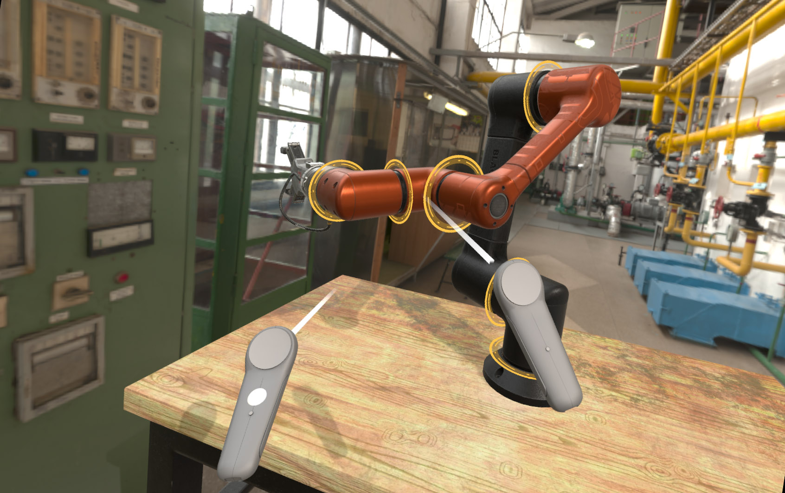

# XR Sample

This demo shows how you can use Evergine in an VR application using OpenXR. In this sample you can control a robot arm using your motion controllers

Robot arm model created by **[re1monsen](https://sketchfab.com/re1monsen)** available in **[Sketchfab](https://sketchfab.com/3d-models/black-honey-robotic-arm-c50671f2a8e74de2a2e687103fdc93ab)** and adapted for this application.

Workbench model created by **[Cosche](https://sketchfab.com/Cosche)** available in **[Sketchfab](https://sketchfab.com/3d-models/work-bench-87b0fa7249cf4382b41c118f665f6439)**.

## Build and Run
- Required Visual Studio 2022 with .NET6 support and Xamarin.Android mobile tools installed

### How to use
 * **Left Click + Mouse**: Interact with the UI to change the car color, open the doors or view the car interior.
 * **Right Click + Mouse**: Camera look.
----
Powered by **[Evergine 3.3 preview](http://www.evergine.net)**

LET'S CONNECT!

- [Youtube](https://www.youtube.com/subscription_center?add_user=EvergineChannel)
- [Twitter](https://twitter.com/EvergineTeam)
- [Blog](http://geeks.ms/evergineteam/)
